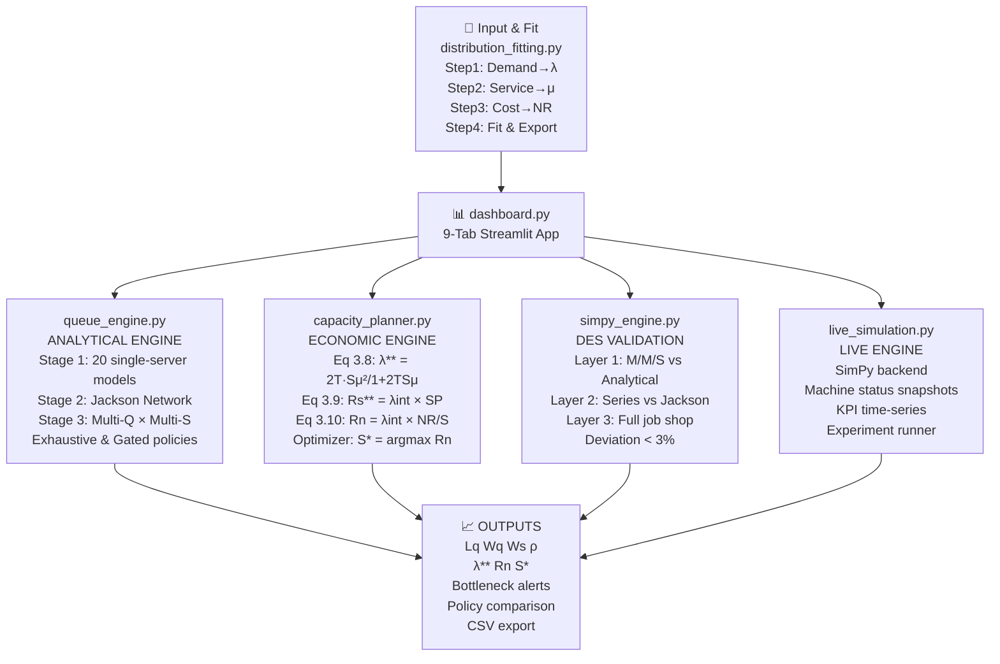
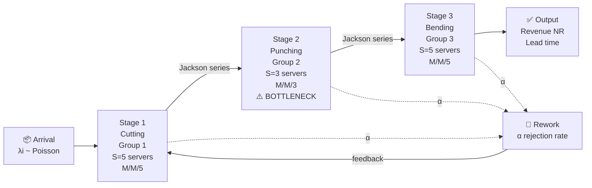
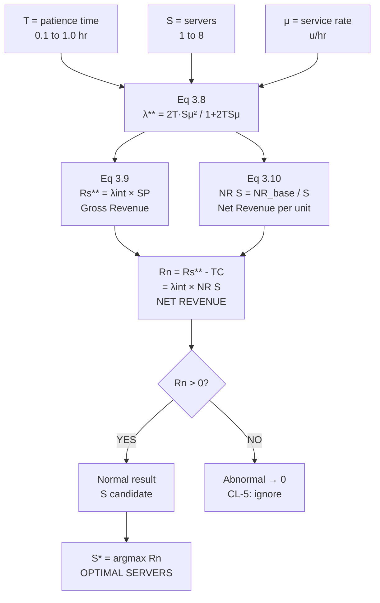
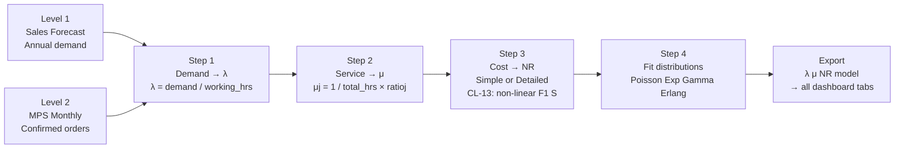

# System Architecture

## Complete Platform Architecture

```mermaid
graph TD
    A[🔧 Input & Fit<br>distribution_fitting.py<br>Step1: Demand→λ<br>Step2: Service→μ<br>Step3: Cost→NR<br>Step4: Fit & Export] --> B

    B[📊 dashboard.py<br>9-Tab Streamlit App] --> C
    B --> D
    B --> E
    B --> F

    C[queue_engine.py<br>ANALYTICAL ENGINE<br>Stage 1: 20 single-server models<br>Stage 2: Jackson Network<br>Stage 3: Multi-Q × Multi-S<br>Exhaustive & Gated policies]

    D[capacity_planner.py<br>ECONOMIC ENGINE<br>Eq 3.8: λ** = 2T·Sμ²/1+2TSμ<br>Eq 3.9: Rs** = λint × SP<br>Eq 3.10: Rn = λint × NR/S<br>Optimizer: S* = argmax Rn]

    E[simpy_engine.py<br>DES VALIDATION<br>Layer 1: M/M/S vs Analytical<br>Layer 2: Series vs Jackson<br>Layer 3: Full job shop<br>Deviation < 3%]

    F[live_simulation.py<br>LIVE ENGINE<br>SimPy backend<br>Machine status snapshots<br>KPI time-series<br>Experiment runner]

    G[📈 OUTPUTS<br>Lq Wq Ws ρ<br>λ** Rn S*<br>Bottleneck alerts<br>Policy comparison<br>CSV export]

    C --> G
    D --> G
    E --> G
    F --> G
```

## Job Flow Through Factory

```mermaid
graph LR
    IN[📦 Arrival<br>λi ~ Poisson] --> S1

    S1[Stage 1<br>Cutting<br>Group 1<br>S=5 servers<br>M/M/5]

    S2[Stage 2<br>Punching<br>Group 2<br>S=3 servers<br>M/M/3<br>⚠️ BOTTLENECK]

    S3[Stage 3<br>Bending<br>Group 3<br>S=5 servers<br>M/M/5]

    OUT[✅ Output<br>Revenue NR<br>Lead time]

    S1 -->|Jackson series| S2
    S2 -->|Jackson series| S3
    S3 --> OUT

    REJ[🔄 Rework<br>α rejection rate] -->|feedback| S1
    S1 -.->|α| REJ
    S2 -.->|α| REJ
    S3 -.->|α| REJ
```

## Economic Optimization Flow

```mermaid
graph TD
    T[T = patience time<br>0.1 to 1.0 hr] --> EQ38
    S[S = servers<br>1 to 8] --> EQ38
    MU[μ = service rate<br>u/hr] --> EQ38

    EQ38[Eq 3.8<br>λ** = 2T·Sμ² / 1+2TSμ] --> EQ39
    EQ38 --> EQ310

    EQ39[Eq 3.9<br>Rs** = λint × SP<br>Gross Revenue] --> RN

    EQ310[Eq 3.10<br>NR S = NR_base / S<br>Net Revenue per unit] --> RN

    RN[Rn = Rs** - TC<br>= λint × NR S<br>NET REVENUE] --> OPT

    OPT{Rn > 0?}
    OPT -->|YES| STABLE[Normal result<br>S candidate]
    OPT -->|NO| IGNORE[Abnormal → 0<br>CL-5: ignore]

    STABLE --> SSTAR[S* = argmax Rn<br>OPTIMAL SERVERS]
```

## Data Pipeline

```mermaid
graph LR
    L1[Level 1<br>Sales Forecast<br>Annual demand] --> STEP1
    L2[Level 2<br>MPS Monthly<br>Confirmed orders] --> STEP1

    STEP1[Step 1<br>Demand → λ<br>λ = demand / working_hrs] --> STEP2
    STEP2[Step 2<br>Service → μ<br>μj = 1 / total_hrs × ratioj] --> STEP3
    STEP3[Step 3<br>Cost → NR<br>Simple or Detailed<br>CL-13: non-linear F1 S] --> STEP4
    STEP4[Step 4<br>Fit distributions<br>Poisson Exp Gamma Erlang] --> EXPORT

    EXPORT[Export<br>λ μ NR model<br>→ all dashboard tabs]
```
